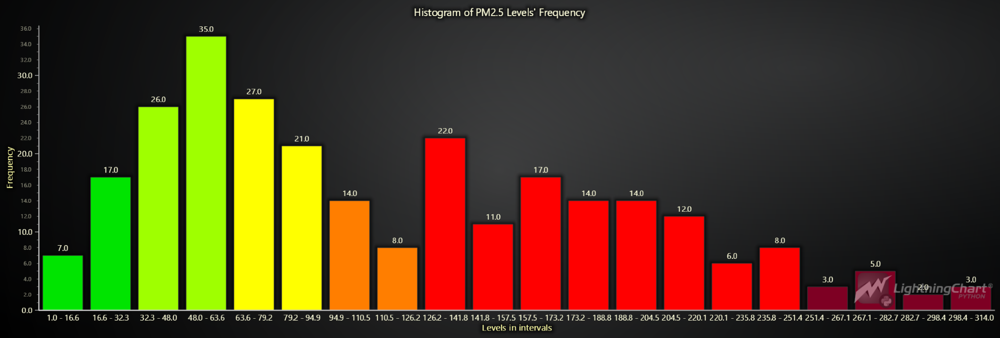
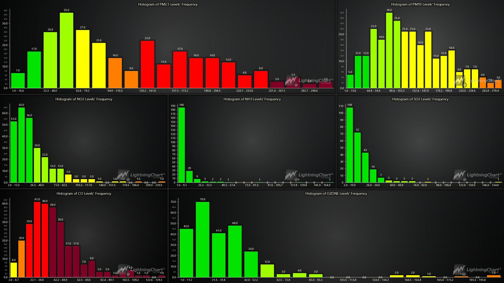
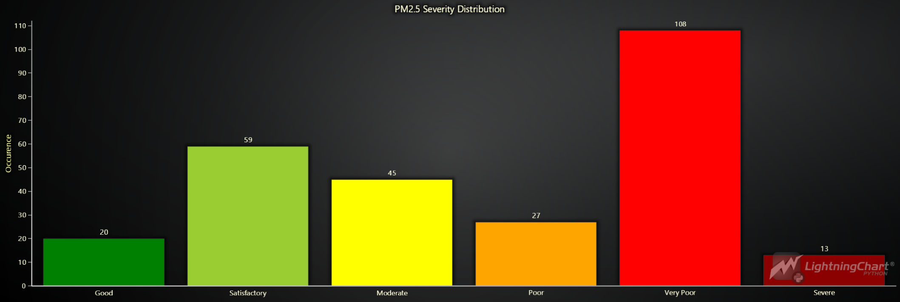
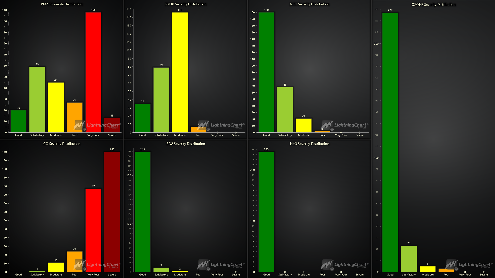
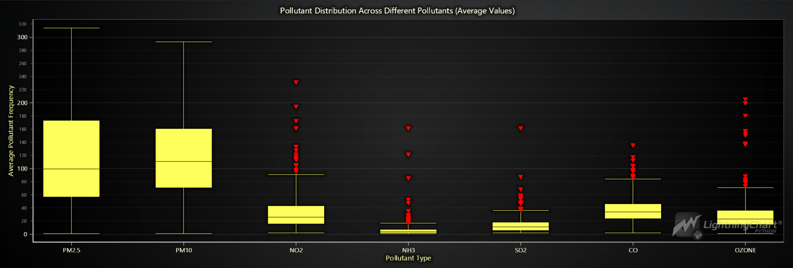
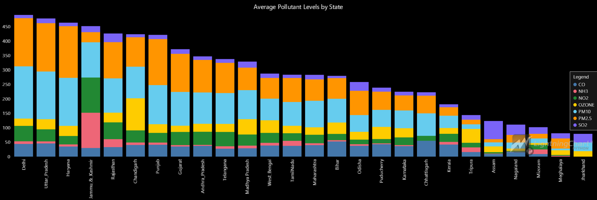
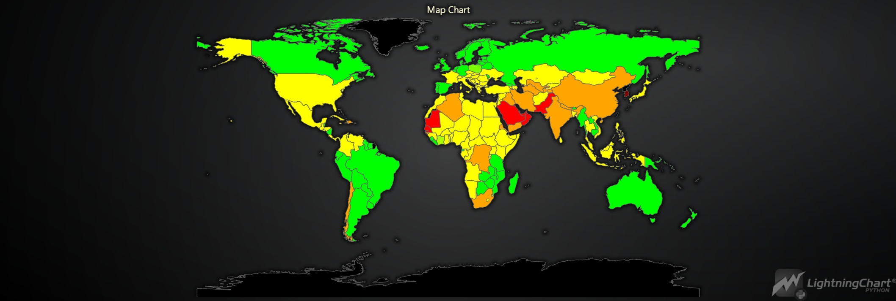

# **Visualizing Air Quality Index (AQI) Data for India Using LightningChart Python**

## **Introduction**

Air Quality Index (AQI) is a key metric used worldwide to assess and communicate air pollution levels. It aggregates data on various pollutants, such as particulate matter (PM2.5, PM10), ozone, and nitrogen dioxide, into a single number that indicates the overall quality of the air.

Monitoring air quality is crucial for public health and environmental protection. In this project, we use LightningChart Python to analyze and visualize AQI data from India.

### **Key Pollutants**

The following pollutants are critical components of the AQI:

* **PM2.5 & PM10** : Particulate matter that poses significant respiratory risks.
* **NO2** : A gas linked to respiratory issues.
* **Ozone (O3)** : Harmful at ground level, contributing to respiratory problems.
* **CO** : A toxic gas from incomplete fuel combustion.
* **SO2** : A gas contributing to respiratory issues and acid rain.
* **NH3** : A compound from agricultural and industrial sources affecting air quality.

For more detailed information about these pollutants, visit WHO's [fact sheet](https://www.who.int/news-room/fact-sheets/detail/ambient-(outdoor)-air-quality-and-health).

## **Setting Up the Python Environment**

To set up the Python environment for this project, you need to install Python and the necessary libraries. This includes installing LightningChart Python and Pandas.

Here's a quick setup guide:

1. **Install Python**: Download and install the latest version of Python from the [official website](https://www.python.org/).
2. **Install Libraries**: Use `pip` to install the required libraries:

   ```bash
   pip install lightningchart pandas numpy pycountry
   ```
3. Set up your development environment by creating a new project directory and installing the required libraries. Ensure that LightningChart Python is properly licensed.

### **Overview of libraries used**

- **Pandas**: For data manipulation and analysis. ([documentation](https://pandas.pydata.org/docs/))
- **NumPy**: For numerical operations. ([documentation](https://numpy.org/doc/stable/))
- **LightningChart Python**: For creating high-performance, interactive data visualizations. ([documentation](https://lightningchart.com/python-charts/docs/))
- **Pycountry**: Used to convert country names to ISO codes for the global AQI map visualization. ([documentation](https://pypi.org/project/pycountry/))

**Note on `pycountry`:** While `pycountry` is a relatively minor library in the context of this project, it played a crucial role in preparing the global AQI map chart. By converting country names to their ISO 3166-1 alpha-3 codes, we ensured accurate data mapping to the corresponding countries. This step, though minor, was essential for the accuracy of the global visualization.

### Working with Jupyter Notebooks in Visual Studio Code

If you're using Visual Studio Code (VSCode) as your development environment, you can run Jupyter notebooks directly within it, which offers a seamless experience.

#### Installing VSCode, Python Extension and Jupyter Extension

1. **Install Visual Studio Code** : If you haven't installed it, download it from the [official website](https://code.visualstudio.com/).
2. **Install the Python Extension**
   * Open VSCode.
   * Go to the "Extensions" by clicking its icon in the Activity Bar on the left side of the window.
   * Search for the "Python" extension by Microsoft and install it.
3. **Install the Jupyter Extension:**
   * In the "Extensions" view, search for "Jupyter" and install the extension by Microsoft.
   * This allows you to run Jupyter notebooks `.ipynb` files directly within VSCode.

## **Loading and Processing Data**

### **Overview of the Dataset**

The dataset used in this project consists of AQI data for various regions across India. It includes AQI values for key pollutants like PM2.5, PM10, and others. The dataset, though static, offers valuable insights into the air quality levels.

### Loading and Processing Data

The data was loaded into the notebook using Pandas:

- **Loading the dataset**:

  ```python
  import pandas as pd

  # Define the file path to the dataset containing India's AQI data.
  file_path_india = 'India_AQI.csv'

  # Read the CSV file into a Pandas DataFrame.
  india_AQI = pd.read_csv(file_path_india)
  ```
- **Handling Missing Data**: Identifying and handling missing or abnormal values.

```python
# Perform forward filling to replace null values in the DataFrame.
india_AQI.ffill(inplace=True)
```

## **Visualizing Data with LightningChart Python**

### **Pollutant Frequency Distribution**

The first step in our analysis was to create a histogram that visualizes the frequency distribution of PM2.5 levels. The colors in this histogram have been adjusted to reflect the severity of the pollutant levels according to India's National AQI thresholds, with higher intervals represented by more intense colors, ranging from green (low severity) to dark red (high severity).

```python
import numpy as np
import lightningchart as lc
lc.set_license("LICENSE_KEY")

# Filter data for a specific pollutant
pollutant_data = india_AQI[india_AQI['pollutant_id'] == 'PM2.5']

# Extract the pollutant average values
y_values = pollutant_data['pollutant_avg'].tolist()

# Define the number of bins for the histogram
num_bins = 20 

# Calculate the histogram data
counts, bin_edges = np.histogram(y_values, bins=num_bins)

# Convert counts to standard Python int type and prepare data for the bar chart
histogram_data = [{'category': f'{bin_edges[i]:.1f} - {bin_edges[i+1]:.1f}', 'value': int(counts[i])} for i in range(len(counts))]

chart = lc.BarChart(
    vertical=True,
    theme=lc.Themes.Dark,
    title="Histogram of PM2.5 Levels' Frequency"
)

chart.set_sorting('disabled')  # Disable sorting to maintain the bin order
chart.set_data(histogram_data)

# Apply AQI-based colors
assign_aqi_colors(chart, bin_edges, 'PM2.5')

# Set titles for the category (X) and value (Y) axes
chart.category_axis.set_title("Levels in intervals")
chart.value_axis.set_title("Frequency")


chart.open()
```



This histogram clearly illustrates the severity of air quality issues, with higher PM2.5 levels marked in more intense colors, signaling more significant health risks.

#### **Dashboard: Combined Pollutant Frequency Distributions**

The initial visualization provides insights into individual pollutants, but a dashboard allows for a more comprehensive analysis. We can simultaneously explore various pollutants and their interrelationships by combining multiple charts into a single interactive dashboard.

Building on the single pollutant visualization, we extended the analysis to include a dashboard that combines histograms for several pollutants, such as PM10, NO2, SO2, CO, and Ozone. The colors in this dashboard have also been adjusted to reflect severity based on AQI thresholds, providing a comprehensive and visually informative overview.

Due to the length and complexity of the code used to generate this dashboard, the full implementation is provided in a separate `dashboard_pollutantFrequency.py` file. Interested readers with LightningChart Python licenses can access this file to explore and run the code themselves.



### **Pollutants' Severity**

Next, we categorized the pollutant levels based on India's national AQI index thresholds once more. Below is the Python code that defines these thresholds and categorizes the PM2.5 levels into different AQI categories:

```python
# Define AQI thresholds for each pollutant
aqi_thresholds = {
    'PM2.5': {'Good': 30, 'Satisfactory': 60, 'Moderate': 90, 'Poor': 120, 'Very Poor': 250},
    'PM10': {'Good': 50, 'Satisfactory': 100, 'Moderate': 250, 'Poor': 350, 'Very Poor': 430},
    'NO2': {'Good': 40, 'Satisfactory': 80, 'Moderate': 180, 'Poor': 280, 'Very Poor': 400},
    'OZONE': {'Good': 50, 'Satisfactory': 100, 'Moderate': 168, 'Poor': 208, 'Very Poor': 748},
    'CO': {'Good': 1.0, 'Satisfactory': 2.0, 'Moderate': 10.0, 'Poor': 17.0, 'Very Poor': 34.0},
    'SO2': {'Good': 40, 'Satisfactory': 80, 'Moderate': 380, 'Poor': 800, 'Very Poor': 1600},
    'NH3': {'Good': 200, 'Satisfactory': 400, 'Moderate': 800, 'Poor': 1200, 'Very Poor': 1800}
}

# Define the function to map pollutant values to AQI categories
def map_to_aqi_category(value, thresholds):
    if value <= thresholds['Good']:
        return 'Good'
    elif value <= thresholds['Satisfactory']:
        return 'Satisfactory'
    elif value <= thresholds['Moderate']:
        return 'Moderate'
    elif value <= thresholds['Poor']:
        return 'Poor'
    elif value <= thresholds['Very Poor']:
        return 'Very Poor'
    else:
        return 'Severe'
```

To illustrate this, we create a bar chart showing the distribution of PM2.5 levels categorized into AQI severity levels:

```python
# Apply the function to create a new column for AQI categories
india_AQI['PM2.5_AQI_Category'] = india_AQI[india_AQI['pollutant_id'] == 'PM2.5']['pollutant_avg'].apply(lambda x: map_to_aqi_category(x, aqi_thresholds['PM2.5']))

# Count the occurrences of each AQI category
ordered_categories = ['Good', 'Satisfactory', 'Moderate', 'Poor', 'Very Poor', 'Severe']
aqi_counts = india_AQI['PM2.5_AQI_Category'].value_counts().reindex(ordered_categories, fill_value=0)

# Prepare data for the bar chart
chart_data = [{'category': category, 'value': count} for category, count in aqi_counts.items()]

chart = lc.BarChart(
    vertical=True,
    theme=lc.Themes.Dark,
    title="PM2.5 Severity Distribution"
)

chart.set_sorting('disabled')
chart.set_data(chart_data)

# Set colors based on AQI categories
colors = {
    'Good': lc.Color('green'),
    'Satisfactory': lc.Color('yellowgreen'),
    'Moderate': lc.Color('yellow'),
    'Poor': lc.Color('orange'),
    'Very Poor': lc.Color('red'),
    'Severe': lc.Color('darkred')
}

# Apply the individual colors to the bars
for i, item in enumerate(chart_data):
    chart.set_bar_color(category=item['category'], color=colors[item['category']])

chart.open()
```



The bar chart above shows how the PM2.5 levels are distributed across different severity categories, from "Good" to "Severe." This clearly explains the severity of air pollution in various regions based on PM2.5 levels.

#### **Dashboard Creation**

While the initial bar chart provides valuable insights, the real power of data visualization lies in seeing the bigger picture. We combined multiple charts representing different pollutants into a single interactive dashboard to achieve this. This dashboard created using LightningChart Python, offers a comprehensive view of India's AQI data, allowing us to explore and interact seamlessly.



The dashboard aggregates the frequency distributions of several key pollutants, including PM2.5, PM10, NO2, NH3, SO2, CO, and Ozone. Each histogram shows how frequently different concentration levels of each pollutant occur. The consistent color-coding across pollutants makes it easy to compare their distributions. For example, PM2.5 and PM10 have significant concentrations in the poor and very poor ranges, while pollutants like SO2 and NH3 generally remain in safer ranges. This comprehensive view allows for a quick assessment of the air quality.

Just like previously mentioned, for the readers who are interested exploring the full code, please check out the accompanying `dashboard_pollutantSeverity.py` file.

### **Pollutant Distribution Analysis**

We used a box plot visualization to understand better the distribution of each pollutant's concentration across the dataset. This type of plot is particularly effective for showing the data spread, including the median, quartiles, and potential outliers for each pollutant.

```python
# Initialize dictionaries to store clean data and outliers for each pollutant.
clean_data = {}
outliers_data = {}

 # Get the unique pollutant types
pollutant_types = india_AQI['pollutant_id'].unique()

# Loop through each pollutant type to identify outliers and clean data.
for pollutant in pollutant_types:
    pollutant_data = india_AQI[india_AQI['pollutant_id'] == pollutant]['pollutant_avg'].dropna().tolist()
    q1 = pd.Series(pollutant_data).quantile(0.25)  # Calculate first quartile
    q3 = pd.Series(pollutant_data).quantile(0.75)  # Calculate third quartile
    iqr = q3 - q1  # Calculate interquartile range
    lower_bound = q1 - 1.5 * iqr  # Define lower bound for outliers
    upper_bound = q3 + 1.5 * iqr  # Define upper bound for outliers
  
    # Separate the outliers from the non-outliers.
    outliers = [x for x in pollutant_data if x < lower_bound or x > upper_bound]
    non_outliers = [x for x in pollutant_data if lower_bound <= x <= upper_bound]
  
    outliers_data[pollutant] = outliers
    clean_data[pollutant] = non_outliers

# Create a box plot using the clean data (excluding outliers).
chart = lc.BoxPlot(
    data=clean_data,
    theme=lc.Themes.Dark,
    title='Pollutant Distribution Across Different Pollutants (Average Values)',
    xlabel='Pollutant Type',
    ylabel='Average Pollutant Frequency'
)

# Manually add outliers to the box plot with specific X coordinates.
x_coordinates = {
    'NO2': 4.5,
    'NH3': 6.5,
    'SO2': 8.5,
    'CO': 10.5,
    'OZONE': 12.5,
}

for pollutant, y_values in outliers_data.items():
    x_value = x_coordinates.get(pollutant, pollutant_types.tolist().index(pollutant))
    series = chart.add_point_series(
        sizes=True,
        rotations=True,
        lookup_values=True
    )
    series.append_samples(
        x_values=[x_value] * len(y_values),  # Assign correct X coordinate
        y_values=y_values,
        sizes=[10] * len(y_values),  # Set a fixed size for outliers
        lookup_values=[1] * len(y_values)  # Max lookup value for color
    )
    series.set_individual_point_color_enabled()
    series.set_point_color(lc.Color('red'))
    series.set_point_shape("triangle")

# Enable cursor mode to show the nearest data point.
chart.set_cursor_mode("show-nearest")

chart.open()
```

The box plot provides an overview of the average concentration values for various pollutants, along with their distribution, including outliers.



The box plot shows the spread of data for pollutants like PM2.5, PM10, NO2, NH3, SO2, CO, and Ozone. The length of each box indicates the interquartile range, while the whiskers show the extent of the data, excluding outliers. Outliers are marked as red points. This visualization helps identify which pollutants have greater variability and extreme values, offering insights into the distribution and concentration of different air pollutants.

#### **State-by-State Comparison of Pollutant Levels**

To gain deeper insights into how air quality varies across different states of India, we compared the average levels of key pollutants across various states. The stacked bar chart below illustrates each state's average concentrations of pollutants like PM2.5, PM10, NO2, SO2, CO, NH3, and Ozone.

```python
# Group data by state and pollutant, calculating the mean pollutant levels for each state
state_comparison = india_AQI.groupby(['state', 'pollutant_id'])['pollutant_avg'].mean().unstack()

# Replace NaN values with 0
state_comparison = state_comparison.fillna(0)

# Prepare data for the stacked bar chart
categories = state_comparison.index.tolist()  # States
sub_categories = state_comparison.columns.tolist()  # Pollutants

# Convert the data to the required format for set_data_stacked
data_for_chart = [{'subCategory': pollutant, 'values': state_comparison[pollutant].tolist()} for pollutant in sub_categories]

# Initialize the bar chart with a black theme
chart = lc.BarChart(
    vertical=True,
    theme=lc.Themes.Black,
    title='Average Pollutant Levels by State'
)

# Set data for the stacked bar chart
chart.set_data_stacked(categories=categories, data=data_for_chart)

# Customize chart appearance
chart.set_value_label_display_mode('hidden')
chart.set_label_rotation(-90)

# Add a legend and display the chart
chart.add_legend().add(chart)
chart.open()
```



This visualization reveals significant differences in pollutant levels across states. For instance, Delhi and Uttar Pradesh show high levels of multiple pollutants, indicating severe air quality issues. The stacked format allows for easy comparison across states, highlighting regions where specific pollutants dominate.

## **Global Air Quality Overview**

While this project primarily focuses on analyzing AQI data within India, it's also valuable to consider air quality in a global context. By visualizing global AQI values using a separate dataset, we can compare India's air quality with other countries, highlighting regional differences and providing a broader perspective on global pollution levels. This global map serves as a complementary analysis, showing how air quality challenges in India align with or differ from those in other parts of the world.

```python
import pycountry  # Used to get ISO 3166-1 alpha-3 country codes

# Extract all unique countries from the dataset.
unique_countries = country_aqi['Country'].unique()

# Create a dictionary to map country names to their ISO alpha-3 codes.
country_to_iso = {}
for country in unique_countries:
    try:
        # Find the ISO code for the country.
        country_data = pycountry.countries.lookup(country)
        country_to_iso[country] = country_data.alpha_3  # Map to alpha-3 ISO code (e.g., FIN for Finland)
    except LookupError:
        print(f"ISO code not found for: {country}")

# Manual mappings for countries that were not found automatically.
manual_ISO = {
    "Bolivia (Plurinational State of)": "BOL",
    "Democratic Republic of the Congo": "COD",
    "Iran (Islamic Republic of)": "IRN",
    "Republic of Korea": "KOR",
    "State of Palestine": "PSE",
    "Turkey": "TUR",  # Needed because Turkey is listed as Türkiye in pycountry's DB
    "Venezuela (Bolivarian Republic of)": "VEN"
}

# Update the main dictionary with the manual ISO codes.
country_to_iso.update(manual_ISO)

# Map the ISO codes to the country_aqi DataFrame.
country_aqi['ISO_A3'] = country_aqi['Country'].map(country_to_iso)

# Filter out rows where the ISO code could not be found.
country_aqi_filtered = country_aqi.dropna(subset=['ISO_A3'])

# Prepare the final list of dictionaries with ISO codes and AQI values.
region_data = country_aqi_filtered[['ISO_A3', 'AQI Value']].rename(columns={'AQI Value': 'value'}).to_dict(orient='records')

# Display the first five entries of the final region data.
region_data[:5]
```

With the ISO codes prepared, we created the following map chart to visualize the global AQI values:

```python
import lightningchart as lc
lc.set_license("LICENSE_KEY")

# Initialize a map chart of the world with a light theme.
chart = lc.MapChart(map_type='World', theme=lc.Themes.Light)

# Apply the AQI data to the map regions.
chart.invalidate_region_values(region_data)

# Set the color palette for the map based on AQI values.
chart.set_palette_colors(
    steps=[
        {'value': 0, 'color': lc.Color('#00FF00')},    # Green for Good (0-50)
        {'value': 50, 'color': lc.Color('#00FF00')},
        {'value': 51, 'color': lc.Color('#FFFF00')},   # Yellow for Moderate (51-100)
        {'value': 100, 'color': lc.Color('#FFFF00')},
        {'value': 101, 'color': lc.Color('#FFA500')},  # Orange for Unhealthy for Sensitive Groups (101-150)
        {'value': 150, 'color': lc.Color('#FFA500')},
        {'value': 151, 'color': lc.Color('#FF0000')},  # Red for Unhealthy (151-200)
        {'value': 200, 'color': lc.Color('#FF0000')},
        {'value': 201, 'color': lc.Color('#800080')},  # Purple for Very Unhealthy (201-300)
        {'value': 300, 'color': lc.Color('#800080')},
        {'value': 301, 'color': lc.Color('#800000')},  # Maroon for Hazardous (301 and higher)
    ],
    look_up_property='value',
    percentage_values=False
)

# Open the map chart
chart.open(live=True)
```



This map highlights global air quality differences, showing which regions face more severe air pollution challenges. Countries with higher AQI values (depicted in orange and red) are primarily located in areas with dense industrial activity, heavy traffic, or natural conditions that exacerbate pollution.

### **Note on Dataset Processing**

Given that this article focuses primarily on India's AQI data, detailed steps for processing the global dataset are not included here. However, the dataset and complete code are available for readers who wish to explore this further. This approach ensures that the article remains focused while providing additional resources for those interested in a broader analysis.

### **Exploring the Visualizations in Detail**

For readers who are interested in exploring each visualization in more depth, the complete Jupyter Notebook file (`india_AQI.ipynb`) used in this project is available. This notebook provides step-by-step code and explanations for every chart and analysis presented in this article. By examining the notebook, you can interact with the data, modify the visualizations, and gain a more thorough understanding of the methods used in this project.

## **Conclusion**

### **Recap of the Python Workflow**

This project demonstrated the use LightningChart Python to analyze and visualize India's air quality data. The workflow involved loading and preprocessing the data, followed by creating various visualizations to explore pollutant distributions and severity levels across different regions.

### **Benefits of Using LightningChart Python For This Project**

LightningChart Python enabled the creation of high-performance, interactive visualizations that made it easier to understand complex AQI data. Its efficiency in handling large datasets and its customizable features made it an excellent choice for this analysis.

## Sources

* [India Dataset](https://www.kaggle.com/datasets/chitwanmanchanda/indias-air-quality-index)
* [Global Dataset](https://www.kaggle.com/datasets/adityaramachandran27/world-air-quality-index-by-city-and-coordinates)
